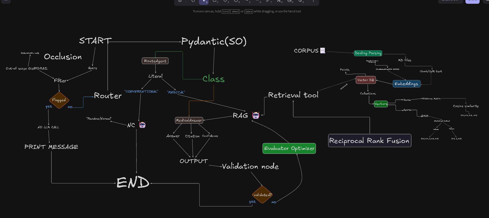

# Occlusion: Chairside Dental Patient FAQ Assistant

[](https://opensource.org/licenses/MIT)
[](https://www.python.org/downloads/)
[](https://langchain-ai.github.io/langgraph/)
[](https://qdrant.tech/)
[](https://pymupdf.readthedocs.io/)
[](https://github.com/explodinggradients/ragas)

> **Status:** MVP in Active Development | **Domain:** Dental Patient Education | **Core Innovation:** Citation-Grounded RAG with Fail-Closed Safety

## 🎯 Executive Summary

**Occlusion** is a production-ready Retrieval-Augmented Generation (RAG) system designed specifically for dental patient education. Unlike generic chatbots, this assistant provides accurate, citation-backed answers to routine dental questions while implementing rigorous safety mechanisms to refuse diagnostic, prescriptive, or out-of-scope inquiries—addressing a critical need in dental practice front-desk operations.

Built as a portfolio/resume project demonstrating advanced LLM application engineering, Occlusion showcases expertise in:
- Hybrid search architectures (dense + sparse vectors)
- LangGraph-based agent orchestration
- Pydantic-structured LLM outputs with validation loops
- Deterministic guardrails for healthcare safety compliance
- Comprehensive evaluation harnesses with Ragas metrics
- Production-ready ingestion pipelines with provenance tracking

## 🔬 Problem Statement

Dental practices experience significant front-desk call volume from patients asking routine questions about post-procedure care, preventive measures, and general oral health. Studies show:
- Front desk staff spend 50-60% of work hours on phone calls
- Practices miss 20-35% of incoming calls during business hours
- 67% of patients still prefer phone over online FAQs for non-simple queries

Traditional static FAQs fail on paraphrased/multi-part questions and provide no audit trail. Occlusion solves this by combining retrieval accuracy with generative flexibility while maintaining strict safety boundaries.

## 💡 Solution Overview

A LangGraph-powered agent that:
1. **Guards** against out-of-scope questions via deterministic rules (zero LLM calls)
2. **Routes** questions to appropriate handlers (casual chat vs. medical inquiry)
3. **Retrieves** using hybrid search (BM25 + dense embeddings) fused with Reciprocal Rank Fusion
4. **Generates** structured answers with inline citations via Pydantic validation
5. **Validates** responses against retrieved sources and confidence thresholds
6. **Iterates** via evaluator-optimizer loops (max 3 attempts) before safe refusal
7. **Attributes** NHS-derived content per Open Government Licence v3.0 requirements

## ⚙️ Technical Architecture



### Core Innovations

#### Hybrid Retrieval with RRF
- **Dense Vectors** (all-MiniLM-L6-v2): Semantic understanding of paraphrased questions
- **Sparse Vectors** (Splade_PP_en_v1): Exact terminology matching (procedure/drug names)
- **Reciprocal Rank Fusion**: Rank-based combination avoiding score normalization issues

#### Safety-First Agent Design
- **Deterministic Guardrail**: Regex-based scope filtering before any LLM interaction
- **Structured Routing**: LLM classification constrained to predefined categories
- **Citation Anchoring**: `[SRC:doc_id]` tokens verified against retrieved chunks
- **Evaluator-Optimizer Loop**: Bounded self-correction with structured feedback (Anthropic pattern)
- **Fail-Closed Validation**: Mechanical checks preventing hallucinated citations

#### Robust Infrastructure
- **Ingestion Pipeline**: Automated parsing, chunking, and vector upserting
- **Versioned Storage**: Qdrant with payload indexes for filtering
- **Observability**: LangSmith tracing for latency, tokens, and cost analysis
- **Evaluation Harness**: Ragas metrics against golden dataset in CI

## 🛠️ Tech Stack

| Category | Technology | Purpose |
|----------|------------|---------|
| **Language** | Python 3.12+ | Core implementation |
| **Framework** | LangGraph | Agent orchestration & state management |
| **Vector DB** | Qdrant | Hybrid dense/sparse vector storage |
| **Embeddings** | FastEmbed (all-MiniLM-L6-v2, Splade_PP_en_v1) | Local embedding generation |
| **Document Processing** | PyMuPDF, WebBaseLoader | PDF/HTML parsing |
| **LLM Outputs** | Pydantic v2 | Structured, validated responses |
| **Evaluation** | Ragas + LangSmith | Faithfulness, relevance, precision metrics |
| **Validation** | Deterministic code | Citation verification, scope checking |
| **Deployment** | (Planned) Hugging Face Spaces | Public demo |

## ✨ Key Features

- **Citation-Grounded Responses**: Every answer includes verifiable `[SRC:doc_id]` inline citations
- **Hybrid Search Superiority**: Combines semantic and lexical search for optimal recall
- **Deterministic Safety**: Hard refusals on out-of-scope questions without LLM involvement
- **Bounded Self-Correction**: Evaluator-optimizer loop with max 3 retry attempts
- **Comprehensive Tracing**: Full observability via LangSmith integration
- **Provenance Tracking**: Detailed documentation of all data sources and licenses
- **Evaluation-Driven Development**: Metrics-guided improvements with golden dataset
- **Modular Architecture**: Clean separation of ingestion, retrieval, agent, and validation layers

## 📊 Evaluation Metrics

*Targets established in advance; measured results recorded as harness phases complete*

| Metric | Target | Status |
|--------|--------|--------|
| Faithfulness (Ragas) | ≥ 0.85 | WIP |
| Context Precision (Ragas) | ≥ 0.75 | WIP |
| Answer Relevancy (Ragas) | ≥ 0.80 | WIP |
| Hybrid vs Dense Recall@5 | Measurable gap | WIP |
| **Refusal Correctness** | **100% — zero slack** | WIP |
| Latency P95 | < 3s | WIP |
| Cost per Query | Documented @ ~500 queries/day | WIP |

> **Hard Ship Gate**: Any trap question answered confidently instead of refused = do not ship, regardless of other metrics.

## 📚 Corpus & Provenance

Curated collection of ~15 openly licensed patient-education documents:
- **4 PDFs**: HRSA (HHS) oral-health guides, NIDCR/NIH patient fact sheets
- **11 HTML pages**: NIDCR, CDC, and NHS UK sources (converted to markdown)

**Licensing & Attribution**:
- US Public Domain: HRSA/NIDCR/CDC materials
- UK OGL v3.0: NHS-derived content requires attribution:  
  *"Contains public sector information licensed under the Open Government Licence v3.0."*

Full provenance documented in [`data/PROVENANCE.md`](data/PROVENANCE.md)

**Explicitly Excluded** (per scope):
- Diagnosis/symptom-specific advice
- Real patient data/PHI
- Appointment booking systems
- Insurance terminology (v1)
- Voice/phone channels
- Fine-tuning
- Multi-lingual support

## 🛠️ Setup & Installation

### Prerequisites
- Python 3.12+
- [uv](https://docs.astral.sh/uv/) (Python package installer)
- API keys for LLM provider (Anthropic Bedrock or Groq)

### Local Development
```bash
# Clone repository
git clone https://github.com/yourusername/Occlusion.git
cd Occlusion

# Setup environment
uv sync
cp sample.env .env  # Fill in required API keys

# Ingest corpus (runs once)
uv run python -m src.ingest.ingestion_pipeline

# Run test suite
uv run pytest tests/ingest/ tests/retrieve/ tests/agent/ -q
```

### Available Commands
- `uv sync` - Install dependencies
- `uv run pytest` - Execute test suite
- `uv run python -m src.ingest.ingestion_pipeline` - Re-ingest corpus
- `uv run pytest tests/agent/test_graph.py::TestAgentGraph::test_refusal_on_out_of_scope -q` - Run specific test

## 🧪 Testing

Comprehensive test suite covering:
- **Unit Tests**: Component-level validation (ingest, retrieve, agent)
- **Integration Tests**: End-to-end flow verification
- **Safety Tests**: Refusal correctness on trap questions
- **Evaluation Tests**: Ragas metric computation

Run full suite: `uv run pytest tests/ -q`

## 📝 Documentation

- [AGENTS.md](AGENTS.md) - Detailed agent implementation specifications
- [SCOPE.md](SCOPE.md) - Project scope, boundaries, and success criteria
- [TODO.md](TODO.md) - Phased development roadmap with verification gates
- [ARCHITECTURE.md](Architecture%20Design%20desc.md) - Deep dive into system design
- [PROVENANCE.md](data/PROVENANCE.md) - Data sources, licenses, and access tracking
- [LOGGING.md](LOGGING.md) - Logging standards and implementation

## 🤝 Contributing

As a portfolio project demonstrating specific engineering competencies, direct code contributions are not sought. However, feedback and discussions are welcome through:
- Issue reports for bugs or unclear documentation
- Pull requests for typo fixes or documentation improvements
- Discussions about architectural decisions or technical approaches

Please review [SCOPE.md](SCOPE.md) and [TODO.md](TODO.md) before suggesting changes to understand project boundaries and current phase.

## 📜 License

This project is licensed under the MIT License - see the [LICENSE](LICENSE) file for details.

**Note**: While the code is MIT-licensed, the corpus contains materials under:
- US Public Domain (HRSA/NIDCR/CDC)
- UK Open Government Licence v3.0 (NHS materials)

NHS-derived outputs require the attribution:  
*"Contains public sector information licensed under the Open Government Licence v3.0."*

## 👤 Portfolio Contact

Developed as a demonstration of applied LLM engineering skills. For opportunities or discussions about similar projects:

- **GitHub**: [https://github.com/snowaflic](https://github.com/snowaflic)
- **LinkedIn**: [Add your LinkedIn profile here]
- **Email**: [Add your professional email here]

---

*Occlusion: Where retrieval accuracy meets generative flexibility in healthcare AI — built with uncompromising safety standards for patient education.*